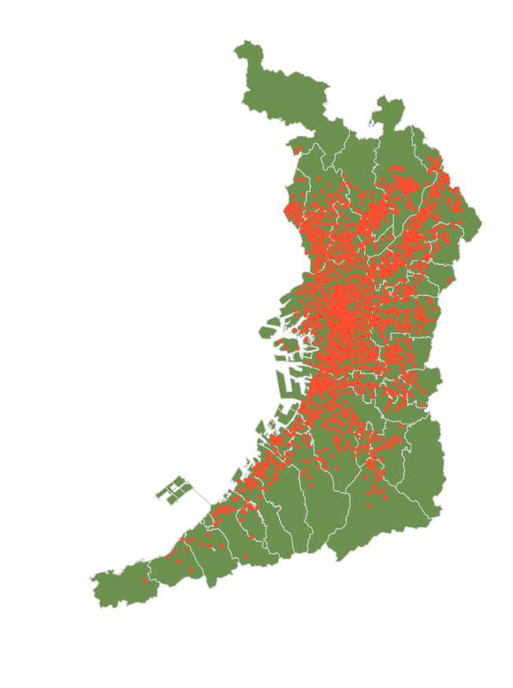
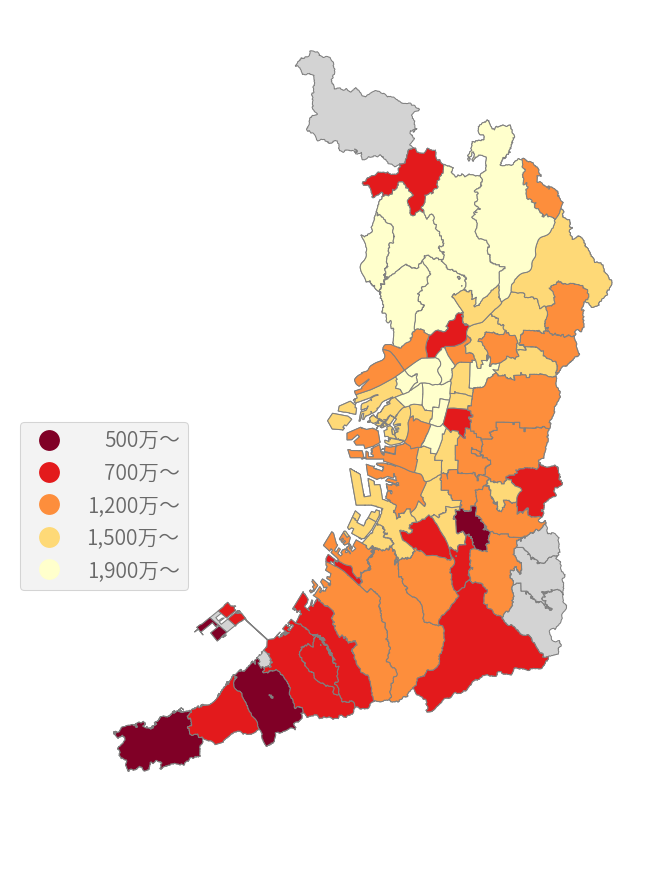
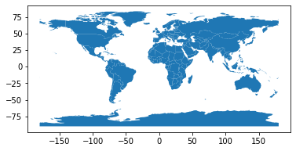
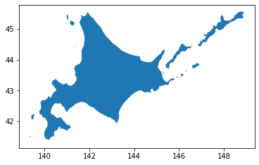

# geopandas

Pythonのライブラリ

### メリットとデメリット
**メリット**

pandasの拡張なので，pandasに慣れていると使いやすい．

サンプルデータがついてくる．

**デメリット**

低レベルライブラリに依存しているため，環境構築時に競合が発生する可能性がある．

### 使用例
geopandasと不動産情報を組み合わせた不動産価格マップ

https://dd1.work/realestate/02_price_on_map/

<p></p>

<p></p>


### 簡単な自作のソースコード

```

import geopandas
import matplotlib.pyplot as plt

world = geopandas.read_file(geopandas.datasets.get_path('naturalearth_lowres'))
world.plot()
plt.show()

```

<p></p>

```

df = gpd.read_file('japan.geojson')

type(df)
# geopandas.geodataframe.GeoDataFrame

isinstance(df, pd.DataFrame)
# True

df.head()
# print(df)
df[df['nam_ja'] == '北海道'].plot()

```

<p></p>
